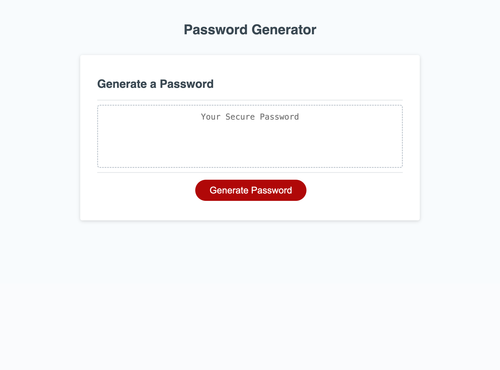

# Welcome to the Module 5 Challenge

# Password-Generator

## Description

 ### This app runs in the browser and features dynamically updated HTML and CSS. Moreover, it is all powered by JavaScript code. This app has  a clean and polished UI which is fully responsive, ensuring that it adapts to multiple screen sizes.

This Password-Generator can include special characters like numbers, lower case letters, upper case letters etc. 

## How to use Password-Generator App:

Your application must:

- Generate a password when the button is clicked.

- Present a series of prompts for password criteria:

- Length of password:

- At least 8 characters but no more than 128.

## Character types:

* Lowercase

* Uppercase

* Numeric

* Special characters ($@%&*, etc.)

Code should validate for each input and at least one character type should be selected.

 ###  Once all prompts are answered, the password should be generated and displayed in an alert or written to the page.

## Github Page:
Use the [link](https://samirabalayoglu.github.io/Password-Generator/) to access the page on the Web. 

## Home Page Screenshot:

## Thanks for your time and consideration. 